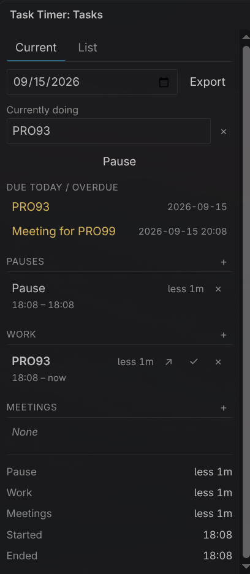
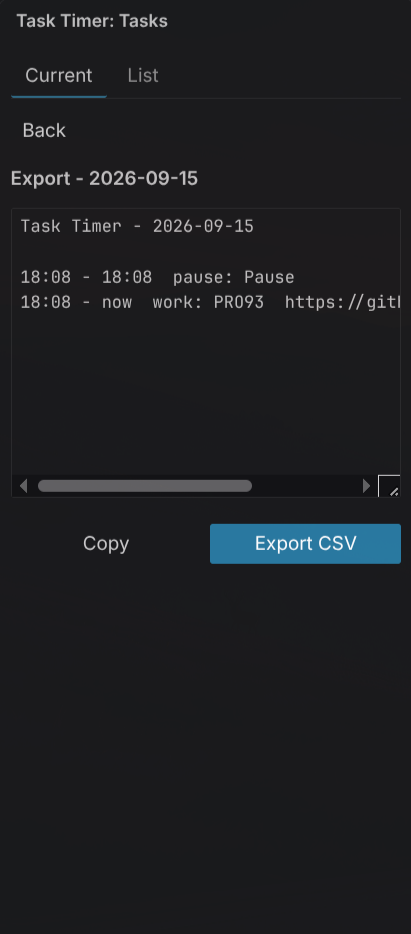

# HS Task Timer

Track time spent on tasks and meetings, right inside VS Code. Still in beta.

## Why

I'm lazy about adding time logs to Jira by hand. Instead, I export the day to CSV, paste the text into Jira Rovo AI, and let it log everything for me.

## Features

- Track time on tasks, meetings, general work, and pauses
- Sidebar with a "Current" view and a "List" view
- Status bar shows the current task and elapsed time
- Git branch detection with a prompt to pick a task when you switch branches
- Deadlines and estimates, with a "due today / overdue" list
- Daily stats summary
- Export a day to CSV
- Quick pick command to switch what you are tracking

## Usage

Open the Task Timer icon in the activity bar. Use the sidebar to create tasks and meetings, then start tracking time on them.

Commands:

- `Task Timer: Switch Task` — pick what to track
- `Task Timer: Start General Work` — start tracking general work
- `Task Timer: Start Pause` — start a pause

## Todo

- Chrome extension for Jira (helper if API is disabled by organisation)
- API sync for Jira and other platforms

## Examples

